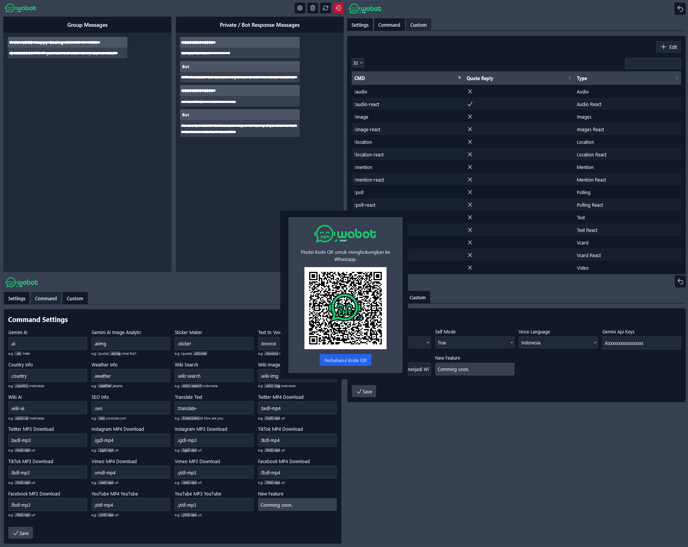

# Watsapp Bot UI

Project provides an intuitive and responsive interface, allowing users to manage conversations, configure bot settings, and monitor activity in real-time

### Features

```
🤖 Artificial Intelligence
├• Gemini AI
└• Gemini AI Image Analytic

🌐 Wikipedia
├• Wiki Search
├• Wiki Image
└• Wiki AI

🕌 Quran
├• Surah
└• Ayah Detail

🔒 Encrypts
├• AES Encrypt
├• AES Decrypt
├• Camelia Encrypt
├• Camelia Decrypt
├• SHA Encrypt
├• MD5 Encrypt
├• Ripemd Encrypt
└• Bcrypt Encrypt

📁 Downloader
├• Twitter MP4/MP3 Download
├• Instagram MP4/MP3 Download
├• TikTok MP4/MP3 Download
├• Vimeo MP4/MP3 Download
├• Facebook MP4/MP3 Download
└• YouTube MP4/MP3 Download

📦 Miscellaneous
├• Sticker Maker
├• Text to Voice (Multi Language)
├• Country Info
├• Weather Info
├• SEO Info
├• Screenshoot Web
├• Github Stalker
├• OCR (Image To Text)
├• Count Words
├• QRCode Generator
├• Translate Text
├• Anti Links
├• Custom Auto Response
├• Custom Manual Messages
└• Anti Badwords
```

### Installation

```
git clone https://github.com/fitri-hy/whatsapp-bot-ui.git
cd whatsapp-bot-ui
npm install
```

### Running Servers

- Double click on the file `start.bat`
- Frontend: `http://localhost:3000/`