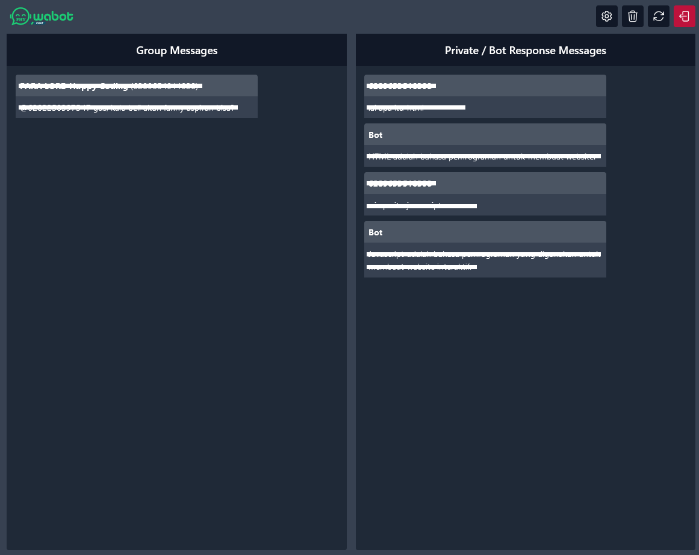
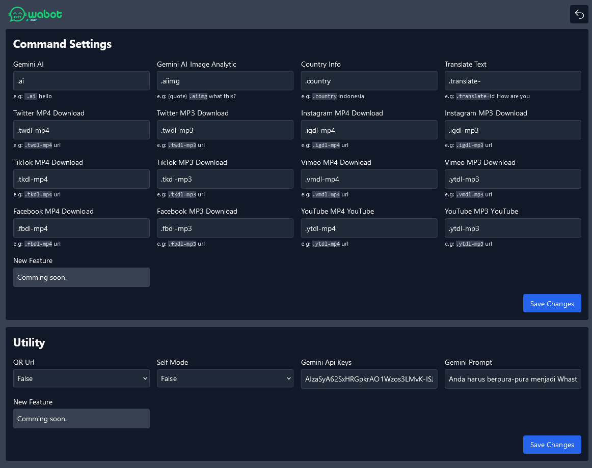

# Watsapp Bot UI

Proyek ini menyediakan antarmuka yang intuitif dan responsif, memungkinkan pengguna untuk mengelola percakapan, mengonfigurasi pengaturan bot, dan memantau aktivitas secara real-time

### Feature

- Custom Response
- Gemini AI
- Gemini Ai Image Analytic
- Sticker Maker
- Text To Voice
- Country Info
- Weather Info
- Seo Info
- Wiki Searching
- Wiki Image
- Wiki AI
- Translate Text
- Twiter Downloader (MP4/MP3)
- Instagram Downloader (MP4/MP3)
- Tiktok Downloader (MP4/MP3)
- Vimeo Downloader (MP4/MP3)
- Facebook Downloader (MP4/MP3)
- Youtube Downloader (MP4/MP3)

### Instalasi

```
git clone https://github.com/fitri-hy/whatsapp-bot-ui.git
cd whatsapp-bot-ui
npm install
```

### Menjalankan Server

- Double klik pada file `start.bat`
- Frontend: `http://localhost:3000/`

### Custom Command Auto Response

Edit file `/settings/auto_response.json`

*#Jangan lupa tinggalkan Bintang dan Fork untuk mendapatkan update terbaru.*
